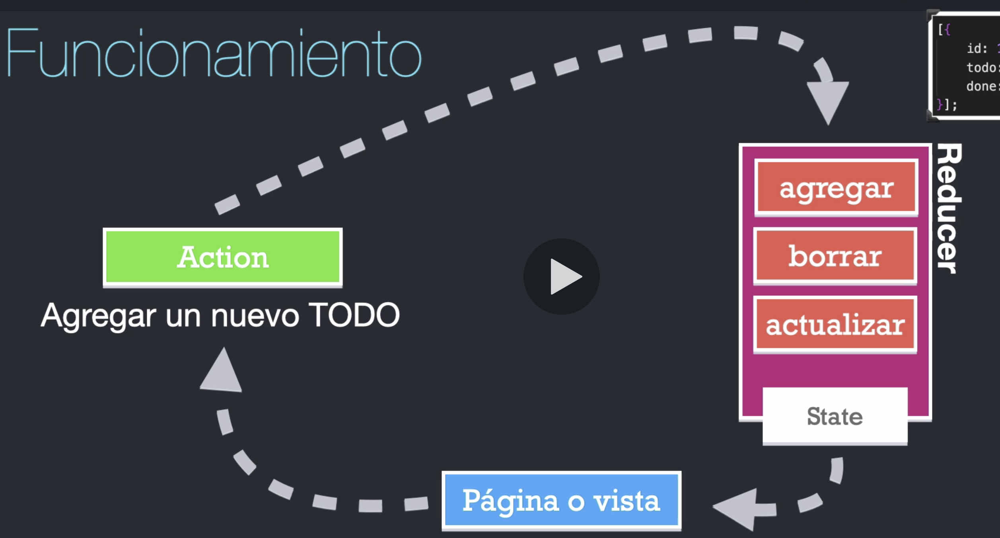

# React Hooks, useReducer, useContext y testing

## Indice
- [Reducers](#Reducers)
- [Context](#Context)
- [Pruebas unitarias y de integración sobre hooks](#Unit-And-Integration-Testing)
### Reducers

#### ¿Qué es un reducer?

Es una función pura

```javascript
const initialToDoItems = [
    {
        id: 1,
        toDo: "Terminar de leer este readme",
        done: false
    }
];

const todoReducer = (state = initialToDoItems, action) => {
    return state;
}
```

1. No debe tener efectos secundarios
2. No debe realizar tareas asincronas
3. Debe retornar siempre un nuevo estado
4. Usualmente recibe dos argumentos (initial state y action)
5. No debe de requerir más que una acción que puede tener un argumento

La idea es tener en un solo lugar todas las posibles modificaciones que mi app puede ejecutar sobre mi estado, conociendo con exactitud donde estan ubicadas estas acciones. Toda la información por ende, fluye en una sola vía, de una forma completamente controlada.



#### useReducer en React JS

Separamos los reducers para mantener un código mas ordenado
```javascript
// ./toDoReducer.js
export const toDoReducer = (state = [], action) => {

    switch (action.type) {

        case 'add':
            return [...state, action.payload];
        case 'delete':
            return state.filter( toDo => toDo.id !== action.payload);
        case 'toggle':
            return state.map( toDo => (toDo.id === action.payload) ? {...toDo, done: !toDo.done} : toDo)
        default:
            return state;
    }
}

// Hook useForm
import { useState } from 'react';

export const useForm = ( initialState = {} ) => {

    const [values, setValues] = useState(initialState);

    const reset = () => {
        setValues(initialState)
    }

    const handleInputChange = ({target}) => {
        setValues({
            ...values,
            [ target.name ]: target.value
        })
    }

    return [values, handleInputChange, reset]

}

```

Aplicando useReducer ejemplo sencillo
```javascript
import React, { useReducer, useEffect } from 'react'
import { toDoReducer } from './toDoReducer';
import { useForm } from './hooks/useForm';

const init = () => {
    return JSON.parse(localStorage.getItem('toDos')) || [];
}

export const ToDoApp = () => {

    const [ toDos, dispatch ] = useReducer(toDoReducer, initialState);

    const [ { description }, handleInputChange, reset] = useForm({
        description: ""
    })

    useEffect(() => {
        localStorage.setItem('toDos', JSON.stringify(toDos))
    }, [toDos])

    const handleDelete = (toDoID) => {
        dispatch({type: "delete", payload: toDoID});
    }

    const handleToggle = (toDoID) => {
        dispatch({type: 'toggle', payload: toDoID});
    }

    const handleSubmit = (e) => {
        e.preventDefault();

        if(description.trim().length <= 1) {
            return;
        }
        const newToDo = {id: new Date().getTime(), description, done: false};

        dispatch({type: 'add', payload: newToDo});
        reset();
    }

    return (
        <div>
            <h1>ToDo App ( {toDos.length} )</h1>
            <hr />
            <div className="row">
                <div className="col-7">
                    <ul>
                        {toDos.map( (toDo, i) => (
                            <li
                                key={toDo.id}
                                className="list-group-item"
                            >
                                <p className={toDo.done ? "complete" : ""} onClick={ () => handleToggle(toDo.id)} >{i + 1}. {toDo.description}</p>
                                <button className="btn btn-danger" onClick={() => handleDelete(toDo.id)}>
                                    Borrar
                                </button>
                            </li>
                        ))}
                    </ul>
                </div>
                <div className="col-5">
                    <h4>Agregar ToDos</h4>
                    <hr />

                    <form onSubmit={handleSubmit}>
                        <input 
                            type="text"
                            name="description"
                            value={description}
                            className="form-control"
                            placeholder="Aprender..."
                            autoComplete="off"
                            onChange={handleInputChange}
                        />
                        <button className="btn btn-outline-primary mt-1 btn-block">
                            Agregar
                        </button>
                    </form> 
                </div>
            </div>

            
        </div>
    )
}

```


### Context

Un problema que se nos plantea en React es cuando tenemos que pasar handlers entre varios hijos de un componente.

[Problemas en React muchos subcomponentes](./teoria/componentsProblem.png)

Y una buena solución que nos brinda React es la posiblidad de usar context
[Context React](./teoria/contextReact.png)

React Router
```javascript
// NavBar.js
import React from 'react'
import { Link, NavLink } from 'react-router-dom'

export const NavBar = () => {
    return (
        <nav>
            <ul>
                <NavLink exact activeClassName="active" to="./">Home</NavLink>
                <NavLink exact activeClassName="active" to="/about">About</NavLink>
                <NavLink exact activeClassName="active" to="/login">Login</NavLink>
            </ul>
        </nav>
    )
}

// AppRouter.js

import React from 'react'
import {    
    BrowserRouter as Router,
    Switch,
    Route,
    Redirect
} from 'react-router-dom'
import { AboutScreen } from './AboutScreen'
import { HomeScreen } from './HomeScreen'
import { LoginScreen } from './LoginScreen'
import { NavBar } from './NavBar'

export const AppRouter = () => {
    return (
        <Router>
            <div>
                <NavBar/>
                <Switch>
                    <Route exact path="/about" component={AboutScreen}/>
                    <Route exact path="/login" component={LoginScreen}/>
                    <Route exact path="/" component={HomeScreen}/>
                    <Redirect to="/"/>
                </Switch>
            </div>
        </Router>
    )
}

// MainApp.js
import React from 'react'
import { AppRouter } from './AppRouter'

export const MainApp = () => {
    return <AppRouter/>
}
```

#### Create Context y useContext
Creamos UserContext

```javascript
// UserContext.js
import { createContext } from 'react';

export const UserContext = createContext(null);

// MainApp.js
import React, { useState } from 'react'
import { AppRouter } from './AppRouter'
import { UserContext } from './UserContext'

export const MainApp = () => {

    const [user, setUser] = useState({});

    return (
        <UserContext.Provider value={{
            user,
            setUser
        }}>
            <AppRouter/>
        </UserContext.Provider>
    )
}

// HomeScreen.js
import React, { useContext } from 'react'
import { UserContext } from './UserContext'

export const HomeScreen = () => {

    const {user, setUser} = useContext(UserContext);

    return (
        <div>
            <h1>HomeScreen</h1>
            <hr/>
        </div>
    )
}
```

### Unit-And-Integration-Testing

Usamos:
[Enzyme JS](https://enzymejs.github.io/enzyme/)
[Enzyme to JSON npm package](https://www.npmjs.com/package/enzyme-to-json)
[React v17 Enzyme Adapter](https://github.com/wojtekmaj/enzyme-adapter-react-17)

1. Instalamos las dependencias

```bash
npm install enzyme-to-json
npm install --save-dev enzyme @wojtekmaj/enzyme-adapter-react-17 @testing-library/react-hooks
```

2. Configuramos el test
```javascript
// setupTests.js
import Enzyme from 'enzyme';
import Adapter from '@wojtekmaj/enzyme-adapter-react-17';
import { createSerializer } from 'enzyme-to-json';

Enzyme.configure({adapter: new Adapter()});
expect.addSnapshotSerializer(createSerializer({mode: 'deep'}));
```

3. Creamos un file de tests y creamos un test,
```javascript
import React from 'react';
import { shallow } from 'enzyme';
import { HookApp } from '../components/HookApp';

describe('Pruebas en <HookApp/>', () => {
    test('Debe mostrarse correctamente', () => {
        const wrapper = shallow(<HookApp/>);
        expect(wrapper).toMatchSnapshot()
    })
})
```

al correrlo con 
```bash
npm run test
```

se nos va a crear el snapshot en la carpeta tests/_snapshots_


Pruebas sobre useCounter (Hook)

```javascript
import { renderHook, act } from '@testing-library/react-hooks';
import { useCounter } from '../../components/hooks/useCounter';


describe('Pruebas en useCounter', () => {

    test('debe de retornar valores por defecto', () => {
        const { result } = renderHook( () => useCounter() );
        expect(result.current.counter).toBe(10);
        expect(typeof result.current.increment).toBe('function');
        expect(typeof result.current.decrement).toBe('function');
        expect(typeof result.current.reset).toBe('function');
    }) 

    test('debe de tener el counter en 100', () => {
        const { result } = renderHook( () => useCounter(100) );
        expect(result.current.counter).toBe(100);
        
    }) 

    test('debe de incrementar el counter en 1 ', () => {
        const {result} = renderHook( () => useCounter(100));
        const { increment } = result.current;

        act( () => {
            increment();
        });

        const { counter } = result.current;
        expect(counter).toBe(101);
    })

    test('debe decrementar el counter en 1', () => {
        const {result} = renderHook( () => useCounter(200));
        const {decrement} = result.current;

        act( () => {
            decrement();
        })

        const {counter} = result.current;
        expect(counter).toBe(199);
    })

    test('debe de reiniciar el counter al valor inicial', () => {
        const initialValue = 1000;
        const {result} = renderHook( () => useCounter(initialValue));
        const {reset, decrement} = result.current;

        act( () => {
            decrement();
            decrement();
            reset()
        })

        const {counter} = result.current;
        expect(counter).toBe(initialValue);
    })
    
    
})
```

Pruebas sobre custom hook

Vamos a probar useForm

```javascript
import { renderHook, act } from '@testing-library/react-hooks';
import {useForm} from '../../components/hooks/useForm'

describe('Pruebas en useForm', () => {
    const initialForm = {
        name: "Juan",
        email: "juan@gmail.com"
    }

    test('debe regresar un formulario por defecto', () => {
        const {result} = renderHook(() => useForm(initialForm))
        const [formValues, handleInputChange, reset] = result.current;
        expect(formValues).toEqual(initialForm)
        expect(typeof handleInputChange).toBe('function')
        expect(typeof reset).toBe('function')
    });

    test('debe de cambiar el valor del formulario (cambiar name)', () => {
        const {result} = renderHook(() => useForm(initialForm))
        const [, handleInputChange] = result.current;
        act( () => {
            handleInputChange({
                target: {
                    name: 'name',
                    value: 'Joe'
                }
            })
        })
        const [formValues] = result.current;
        expect(formValues).toEqual({...initialForm, name: 'Joe'})
    });

    test('debe de restablecer el formulario con RESET', () => {
        const {result} = renderHook(() => useForm(initialForm))
        const [, handleInputChange, reset] = result.current;
        act( () => {
            handleInputChange({
                target: {
                    name: 'name',
                    value: 'Joe'
                }
            })
            reset();
        })
        const [formValues] = result.current;
        expect(formValues).toEqual(initialForm)

    })
    
    
    
})

```

Pruebas sobre useFetch (customHook)

```javascript
import { renderHook } from "@testing-library/react-hooks"
import { useFetch } from "../../components/hooks/useFetch"


describe('Pruebas en useFetch', () => {
    test('debe de retornar la info por defecto', () => {
        const {result} = renderHook( () => useFetch('https://www.breakingbadapi.com/api/quotes/1'));

        const {data, loading, error} = result.current;
        expect(data).toBe(null);
        expect(loading).toBe(true);
        expect(error).toBe(null)
    })

    test('debe de tener la info deseada, loading false, error false', async () => {
        const {result, waitForNextUpdate} = renderHook( () => useFetch('https://www.breakingbadapi.com/api/quotes/1'));
        await waitForNextUpdate({timeout: 5000});

        const {data, loading, error} = result.current;
       
        expect(data.length).toBe(1)
        expect(loading).toBe(false)
        expect(error).toBe(null)
    })

    test('debe de manejar el error', async () => {
        const {result, waitForNextUpdate} = renderHook( () => useFetch('https://www.reqres.in/apid/users?page=2'));
        await waitForNextUpdate({timeout: 5000});

        const {data, loading, error} = result.current;
       
        expect(data).toBe(null)
        expect(loading).toBe(false)
        expect(error).toBe('No se pudo cargar la info')
    })
    
    
})
```


Pruebas sobre MultipleCustomHooks

```javascript
import React from 'react'
import { shallow } from "enzyme"
import { MultipleCustomHooks } from '../../../components/Curso/03-examples/MultipleCustomHooks'
import { useFetch } from '../../../components/hooks/useFetch'
import { useCounter } from '../../../components/hooks/useCounter'
jest.mock('../../../components/hooks/useFetch')
jest.mock('../../../components/hooks/useCounter')

describe('Pruebas en <MultipleCustomHooks />', () => {

    beforeEach( () => {
        useCounter.mockReturnValue({
            counter: 10,
            increment: () => {}
        });
    })
    
    test('debe de mostrarse correctamente', () => {

        useFetch.mockReturnValue({
            data: null,
            loading: true,
            error: null
        })
        
        const wrapper = shallow(<MultipleCustomHooks />);
        expect(wrapper).toMatchSnapshot();
    })

    test('debe de mostrar la informacion', () => {
        
        useFetch.mockReturnValue({
            data: [{
                author: "Lenny",
                quote: "Hello World"
            }],
            loading: false,
            error: null
        });

        const wrapper = shallow(<MultipleCustomHooks />);
        expect(wrapper.find('.alert').exists()).toBe(false)
        expect(wrapper.find('.mb-0').text().trim()).toBe('Hello World')
        expect(wrapper.find('footer').text().trim()).toBe('Lenny')
    })
    
    
})
```

Interacciones con el useState
```javascript
import React from 'react'
import { shallow } from 'enzyme'

import { RealExampleRef } from '../../../components/Curso/04-useRef/RealExampleRef'


describe('Pruebas en <RealExampleRef/>', () => {
    
    const wrapper = shallow(<RealExampleRef/>)

    test('debe mostrarse correctamente', () => {
        
        expect(wrapper).toMatchSnapshot();
        expect(wrapper.find('MultipleCustomHooks').exists()).toBe(false)
    })

    test('debe mostrar el componente', () => {
        wrapper.find('button').simulate('click');
        expect(wrapper.find('MultipleCustomHooks').exists()).toBe(true)
    })
    
    

})
```

Pruebas sobre el Reducer

```javascript
import { todoReducer } from "../../../components/Curso/08-useReducer/todoReducer"
import { demoTodos } from "../../fixtures/demoTodos";


describe('Pruebas en todoReducer', () => {
    
    test('debe de retornar el estado por defecto', () => {
        const state = todoReducer(demoTodos, {});

        expect(state).toEqual(demoTodos)

    })

    test('debe de agregar un TO DO', () => {
        const newToDo = {
            id: 3,
            desc: 'Aprender Angular',
            done: false
        };

        const action = {
            type: 'add', 
            payload: newToDo
        };

        const state = todoReducer(demoTodos, action);

        expect(state.length).toBe(3);
        expect(state).toEqual([...demoTodos, newToDo])
    })

    test('debe de borrar el TO DO', () => {
        const action = {type: 'delete', payload: 1};

        const state = todoReducer(demoTodos, action);
        expect(state.length).toBe(1);
        expect(state).toEqual([ demoTodos[1]]);
    })

    test('debe de hacer el toggle del TO DO', () => {
        const action = {type: 'toggle', payload: 2};

        const state = todoReducer(demoTodos, action);
        expect(state.length).toBe(2);
        expect(state[1].done).toBe(true);
        expect(state[0]).toEqual(demoTodos[0])
    })
    
})
```

Pruebas en ToDoListItem
```javascript
import {shallow} from 'enzyme'
import React from 'react'
import { ToDoListItem } from '../../../components/ToDoListItem'
import { demoTodos } from '../../fixtures/demoTodos'


describe('Pruebas en ,ToDoListItem/>', () => {

    const handleDelete = jest.fn();
    const handleToggle = jest.fn();

    const wrapper = shallow(
        <ToDoListItem
            toDo={demoTodos[0]}
            index={0}
            handleDelete={handleDelete}
            handleToggle={handleToggle}
        />
    )
    
    test('debe de mostrarse correctamente ', () => {                
        expect(wrapper).toMatchSnapshot();
    })

    test('debe de llamar la función borrar', () => {
        
        wrapper.find('button').simulate('click');
        expect(handleDelete).toHaveBeenCalledWith(demoTodos[0].id)

    })
    
    test('debe de llamar la función toggle', () => {

        wrapper.find('p').simulate('click');
        expect(handleToggle).toHaveBeenCalledWith(demoTodos[0].id)
    })

    test('debe de mostrar el texto correctamente', () => {
        const p = wrapper.find('p');
        expect(p.text().trim()).toBe(`1. ${demoTodos[0].desc}`)
    })
    
    test('debe de tener la clase complete si el TO DO esta hecho', () => {
        const todo = demoTodos[0];
        todo.done = true;

        const wrapper = shallow(
            <ToDoListItem
                toDo={todo}
                index={0}
                handleDelete={handleDelete}
                handleToggle={handleToggle}
            />
        )

        expect(wrapper.find('p').hasClass('complete')).toBe(true)
    })
    

})

```


Pruebas en ToDoList

```javascript
import React from 'react'
import {shallow} from 'enzyme'

import { ToDoList } from '../../../components/ToDoList'
import { demoTodos } from '../../fixtures/demoTodos'


describe('Pruebas en <ToDoList/>', () => {

    const handleDelete = jest.fn();
    const handleToggle = jest.fn();
        
    const wrapper = shallow(
        <ToDoList
            toDos={ demoTodos }
            handleDelete={handleDelete}
            handleToggle={handleToggle}
        />
    )
    
    test('debe de mostrarse correctamente ', () => {

       expect(wrapper).toMatchSnapshot()

    })

    test('debe tener 2 <ToDoListItem />', () => {

        expect(wrapper.find('ToDoListItem').length).toBe(demoTodos.length);

        expect(wrapper.find('ToDoListItem').at(0).prop('handleDelete')).toEqual(expect.any(Function))
 
     })
    

})

```

Pruebas sobre toDoAdd

```javascript
import React from 'react'
import {shallow} from 'enzyme'
import { ToDoAdd } from '../../../components/ToDoAdd'


describe('Pruebas sobre <ToDoAdd/>', () => {

    const handleAddToDo = jest.fn()

    const wrapper = shallow(
        <ToDoAdd
            handleAddToDo={handleAddToDo}
        />
    )
    
    test('debe de mostrarse correctamente ', () => {
        expect(wrapper).toMatchSnapshot()
    })

    test('NO debe de llamar handleAddToDo', () => {
        
        const formSubmit = wrapper.find('form').prop('onSubmit');

        formSubmit({ preventDefault(){}});

        expect(handleAddToDo).toHaveBeenCalledTimes(0);
    })

    test('debe de llamar la funcion handleAddToDo', () => {
        const value = 'Aprender react';

        wrapper.find('input').simulate('change', {
            target: {
                value,
                name: 'description'
            }
        })

        const formSubmit = wrapper.find('form').prop('onSubmit');

        formSubmit({ preventDefault(){}});

        expect(handleAddToDo).toHaveBeenCalledTimes(1);
        expect(handleAddToDo).toHaveBeenCalledWith(expect.any(Object));
        expect(handleAddToDo).toHaveBeenCalledWith({
            id: expect.any(Number),
            desc: value,
            done: false
        });

        expect(wrapper.find('input').prop('value')).toBe('')

    })
    
})

```


Pruebas sobre ToDoApp

```javascript

import React from 'react'
import { mount, shallow } from 'enzyme'

import { ToDoApp } from '../../../components/ToDoApp'
import { demoTodos } from '../../fixtures/demoTodos';
import { act } from '@testing-library/react';


describe('Pruebas sobre <ToDoApp/>', () => {
    
    const wrapper = shallow(
        <ToDoApp/>
    );

    Storage.prototype.setItem = jest.fn(()=>{})

    test('debe de mostrarse correctamente', () => {
        expect(wrapper).toMatchSnapshot();
    })

    test('debe de agregar un TO DO', () => {
        
        const wrapper = mount(<ToDoApp/>);

        act( () => {
            wrapper.find('ToDoAdd').prop('handleAddToDo')( demoTodos[0] );
            wrapper.find('ToDoAdd').prop('handleAddToDo')( demoTodos[1] );
        })

        expect(wrapper.find('h1').text().trim()).toBe('ToDo App ( 2 )')
        expect(localStorage.setItem).toHaveBeenCalledTimes(2)

    })
    
    test('debe de eliminar un TO DO', () => {
        wrapper.find('ToDoAdd').prop('handleAddToDo')( demoTodos[0] )
        wrapper.find('ToDoList').prop('handleDelete')( demoTodos[0].id )
        expect(wrapper.find('h1').text().trim()).toBe('ToDo App ( 0 )')
    })
    
    

})

```


Pruebas sobre useContext

